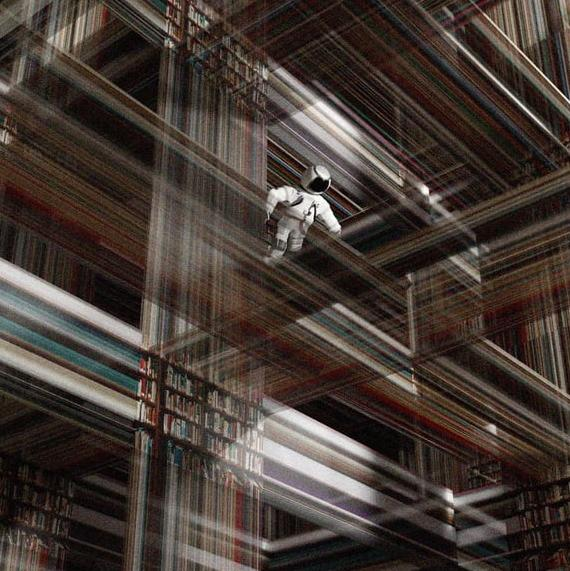

# LLQCE
Library Learning in Quantum Computer Engineering

### ToDo:
- [x] Try Stitch rtd tutorial
- [ ] Try DreamCoder
- [x] Convert Qiskit circuits to typed-lambda calculus and use Stitch
- [ ] Analyse Library based on memory, search time, composition length, usage frequency
    - [x] Check invariance of library with size of random 1-qubit unitary dataset
    - [x] Find usage frequency of each native gate and gadget
    - [x] Plot freqency rank (X) to frequency (Y) for various settings of iterations
    - [ ] Find relation with Mandelbrot-Zipf law
- [ ] Use YAQQ gate set vs. H,T,Tdg
